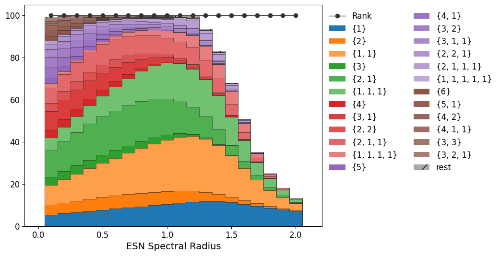

# `ipc-module`

`ipc-module` is a Python module for measuring and analyzing [information processing capacity (IPC)](https://doi.org/10.1038/srep00514), an indicator proposed in reservoir computing.
Using `pytorch` and `cupy`, it can quickly measure the IPC of various systems.
Currently, it supports the measurement of IPC for one-dimensional inputs.
It is also possible to measure the IPC for arbitrary input time series distributions using Gram-Schmidt orthogonalization.

## Installation

```bash
pip install ipc-module
```

Alternatively, you can use various project management tools (such as `uv`, `poetry`, `pipenv`, etc.) to install it.

## Usage

In short, IPC is a metric that evaluates how much a system can process input time-series information.
Specifically, it generates various linear and nonlinear transformations of input time series using orthogonal polynomials without duplication and evaluates how well each transformation can be reproduced from the system's current state.
For a detailed explanation of IPC and more usage examples of `ipc-module`, refer to **Chapters 6 and 7** and the sample code of [**RC bootcamp**](https://rc-bootcamp.github.io/), a hands-on resource for reservoir computing beginners.

### Measuring IPC of echo state network

As an example, we show how to measure the IPC of an echo state network (ESN), a type of recurrent neural network.
In the following cell, we generate a 1-input, 100-dimensional ESN and store its response to a 100,000-step input time series generated from i.i.d. uniform random numbers in [-1, 1] as `xs`.
When you use it, replace this `xs` with the time series of the system to be measured.


```python
import numpy as np

seed = 1234
input_dim = 1
esn_dim = 100
time_steps = 100000
esn_sr = np.linspace(0, 2.0, 21)[1:]  # Spectral radii to test.

rnds = np.random.default_rng(seed).spawn(4)
x0 = rnds[0].uniform(-1, 1, (len(esn_sr), esn_dim))
us = rnds[1].uniform(-1, 1, (time_steps, input_dim))  # Input signal.
w_esn = rnds[2].normal(0, 1 / np.sqrt(esn_dim), (esn_dim, esn_dim))
w_esn /= np.abs(np.linalg.eigvals(w_esn)).max()  # Normalize to spectral radius 1.
w_in = rnds[3].normal(0, 1, (esn_dim, input_dim))

x = x0
xs = np.zeros((time_steps, *x0.shape), dtype=x0.dtype)
for idx in range(time_steps):
    xw = esn_sr[..., None] * (x[..., None, :] @ w_esn.T)[..., 0, :]
    uw = us[idx : idx + 1] @ w_in.T
    x = np.tanh(xw + (0.5 * uw + 0.5))  # Asymmetric input.
    # x = np.tanh(xw + uw)  # Symmetric input.
    xs[idx] = x

print(f"shape of xs: {xs.shape}")
```

    shape of xs: (100000, 20, 100)


The response of the ESN, with spectral radius varying from 0.1 to 2.0 in 0.1 steps, is stored, so the shape of `xs` is `(100000, 20, 100)`.
In the next cell, we measure the IPC for this response `xs` all at once.
Besides `numpy`, `pytorch` and `cupy` can also be used for fast computation on a GPU.
This calculation is done using the [`profiler.UnivariateProfiler`](profiler.md#ipc_module.profiler.UnivariateProfiler) class as follows:


```python
from ipc_module.config import set_progress_bar
from ipc_module.profiler import UnivariateProfiler

set_progress_bar(False)  # Global setting to hide progress bars.

backend = "torch"
assert backend in ["numpy", "torch", "cupy"], "Invalid backend."

if backend == "torch":
    import torch

    xs_c, us_c = torch.from_numpy(xs).cuda(), torch.from_numpy(us).cuda()
elif backend == "cupy":
    import cupy

    xs_c, us_c = cupy.asarray(xs), cupy.asarray(us)
else:
    xs_c, us_c = xs, us


profiler = UnivariateProfiler(
    us_c,
    xs_c,
    poly_name="GramSchmidt",
    surrogate_num=1000,
    surrogate_seed=0,
    offset=1000,
    axis1=0,
    axis2=-1,
)
```

In IPC, transformations of the input time series are calculated by varying the degree, which represents the strength of nonlinearity, and the delay of the input.
The [`calc`](profiler.md#ipc_module.profiler.UnivariateProfiler.calc) method calculates the IPC by specifying the degree and the corresponding maximum delay.
The results can be saved in `npz` format using the [`save`](profiler.md#ipc_module.profiler.UnivariateViewer.save) method.


```python
degrees = [1, 2, 3, 4, 5, 6]
taus = [200, 100, 50, 20, 10, 5]
for deg, tau in zip(degrees, taus, strict=True):
    profiler.calc(deg, tau + 1, zero_offset=True)
profiler.save("./ipc_esn.npz", esn_sr=esn_sr, esn_dim=esn_dim)
```

You can load saved results with [`profiler.UnivariateViewer`](profiler.md#ipc_module.profiler.UnivariateViewer), the parent class of [`profiler.UnivariateProfiler`](profiler.md#ipc_module.profiler.UnivariateProfiler).
But since [`profiler.UnivariateViewer`](profiler.md#ipc_module.profiler.UnivariateViewer) doesn't possess `us` or `xs`, it can't calculate IPC.
Use [`profiler.UnivariateViewer.to_dataframe`](profiler.md#ipc_module.profiler.UnivariateViewer.to_dataframe) and [`helper.visualize_dataframe`](helper.md#ipc_module.helper.visualize_dataframe) to visualize IPC results like this:


```python
import matplotlib.pyplot as plt

plt.rcParams["figure.facecolor"] = (1, 1, 1, 0.5)
plt.rcParams["axes.facecolor"] = (1, 1, 1, 0.5)

from ipc_module.helper import visualize_dataframe
from ipc_module.profiler import UnivariateViewer

viewer = UnivariateViewer("./ipc_esn.npz")
esn_sr, esn_dim = viewer.info["esn_sr"], viewer.info["esn_dim"]
df, rank = viewer.to_dataframe(max_scale=1.0, truncate_by_rank=True)

fig, ax = plt.subplots(1, 1, figsize=(8, 6))
visualize_dataframe(
    ax,
    df,
    xticks=esn_sr,
    threshold=0.5,
    cmap="tab10",
    group_by="component",  # NOTE: Either "degree", "component", or "detail" is available.
    fontsize=12,
)
ax.plot(esn_sr, rank, lw=1.0, color="#333333", marker="o", label="Rank")
ax.legend(fontsize=12, loc="upper left", frameon=False, bbox_to_anchor=(1.0, 1.0), ncol=2)
# ax.set_ylim([0, esn_dim * 1.05])
ax.set_xlabel("ESN Spectral Radius", fontsize=14)

None
```


    

    


## License

`ipc-module` is provided under the [MIT License](https://opensource.org/licenses/MIT).
You are free to use, modify, and redistribute it.
However, you must include the copyright notice and this permission notice in all copies or substantial portions of the software.

## Contributing

We welcome contributions to the development of `ipc-module`.

### Reporting issues

If you find any bugs or have suggestions for improvement, please report them on the [GitHub Issues page](https://github.com/rc-bootcamp/ipc-module/issues).

### Citation

If you use `ipc-module` in your research or development, please cite the following details about [RC bootcamp](https://rc-bootcamp.github.io/) and its paper.
`ipc-module` is part of RC bootcamp and was released on PyPI at the same time as its publication.

```bibtex
@article{inoue2025rcbootcamp,
  title   = {Reservoir computing bootcamp---from Python/NumPy tutorial for the complete beginners to cutting-edge research topics of reservoir computing},
  author  = {Inoue, Katsuma and Kubota, Tomoyuki and Tran, Quoc Hoan and Akashi, Nozomi and Terajima, Ryo and Kabayama, Tempei and Guan, JingChuan and Nakajima, Kohei},
  year    = 2025,
  month   = XX,
  journal = {XX},
  volume  = {XX},
  number  = {X},
  pages   = {XXXXXX},
  issn    = {XXXX-XXXX},
  doi     = {10.1063/5.0283386}
}
```

## Contact

For questions or feedback about `ipc-module`, contact us at `k-inoue[at]isi.imi.i.u-tokyo.ac.jp`.
